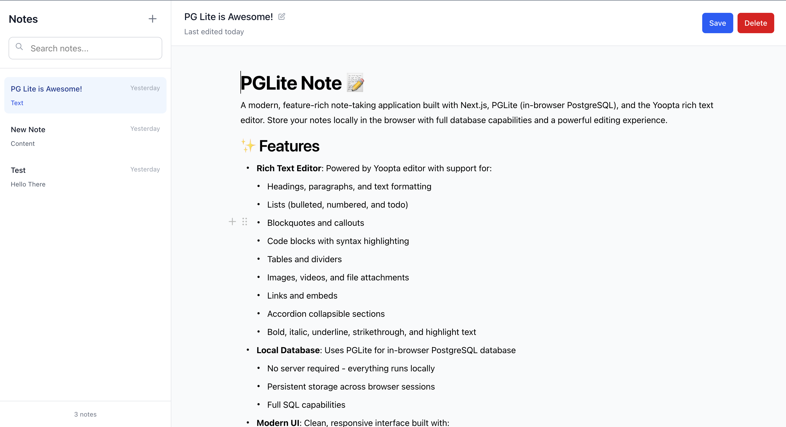

# PGLite Note 📝

A modern, feature-rich note-taking application built with Next.js, [PGLite](https://pglite.dev/) (in-browser PostgreSQL), and the Yoopta rich text editor. Store your notes locally in the browser with full database capabilities and a powerful editing experience.



## ✨ Features

- **Rich Text Editor**: Powered by Yoopta editor with support for:
  - Headings, paragraphs, and text formatting
  - Lists (bulleted, numbered, and todo)
  - Blockquotes and callouts
  - Code blocks with syntax highlighting
  - Tables and dividers
  - Images, videos, and file attachments
  - Links and embeds
  - Accordion collapsible sections
  - Bold, italic, underline, strikethrough, and highlight text

- **Local Database**: Uses PGLite for in-browser PostgreSQL database
  - No server required - everything runs locally
  - Persistent storage across browser sessions
  - Full SQL capabilities

- **Modern UI**: Clean, responsive interface built with:
  - Next.js 15 with React 19
  - Tailwind CSS for styling
  - TypeScript for type safety
  - Responsive design for all devices

- **Note Management**:
  - Create, edit, and delete notes
  - Inline title editing
  - Auto-save functionality
  - Sidebar navigation
  - Loading states and error handling

## 🛠️ Tech Stack

- **Frontend Framework**: Next.js 15 with React 19
- **Database**: [PGLite](https://github.com/ept/pglite) (in-browser PostgreSQL)
- **Rich Text Editor**: Yoopta Editor with Slate.js
- **Styling**: Tailwind CSS 4
- **Language**: TypeScript
- **Package Manager**: Bun (recommended), npm, or pnpm
- **Build Tool**: Next.js with Turbopack

## 📁 Project Structure

```
pglite-note/
├── src/
│   ├── components/          # React components
│   │   ├── FullSetupEditor.tsx  # Rich text editor setup
│   │   └── Sidebar.tsx          # Note navigation sidebar
│   ├── config/              # Configuration files
│   │   ├── initValue.ts     # Editor initial values
│   │   └── plugins.ts       # Yoopta editor plugins
│   ├── pages/               # Next.js pages
│   │   ├── _app.tsx         # App wrapper
│   │   ├── _document.tsx    # Document wrapper
│   │   └── index.tsx        # Main editor page
│   ├── services/            # Service layer
│   ├── styles/              # Global styles
│   ├── types/               # TypeScript type definitions
│   │   ├── db.ts            # Database types
│   │   └── note.ts          # Note interface
│   └── utils/               # Utility functions
│       ├── database.ts      # Database operations
│       └── editor.ts        # Editor utilities
├── public/                  # Static assets
├── package.json             # Dependencies and scripts
└── README.md               # This file
```

## 🗄️ Database Schema

The application uses [PGLite](https://github.com/ept/pglite) with a simple but effective database schema:

```sql
CREATE TABLE notes (
  id SERIAL PRIMARY KEY,
  title TEXT NOT NULL,
  content TEXT,
  created_at TIMESTAMP DEFAULT CURRENT_TIMESTAMP,
  updated_at TIMESTAMP DEFAULT CURRENT_TIMESTAMP
);
```

## 🔧 Configuration

### Editor Plugins

The Yoopta editor is configured with a comprehensive set of plugins in `src/config/plugins.ts`:

- **Text Elements**: Paragraphs, headings, blockquotes
- **Lists**: Bulleted, numbered, and todo lists
- **Media**: Images, videos, file attachments
- **Interactive**: Tables, accordions, callouts
- **Formatting**: Bold, italic, underline, code, links

### Database Configuration

[PGLite](https://github.com/ept/pglite) is configured to use IndexedDB for persistent storage:

```typescript
export const db = new PGlite("idb://my-pgdata");
```

PGLite provides a full PostgreSQL-compatible database that runs entirely in the browser, offering:
- Full SQL support with PostgreSQL syntax
- ACID transactions
- Persistent storage using IndexedDB
- No server setup required
